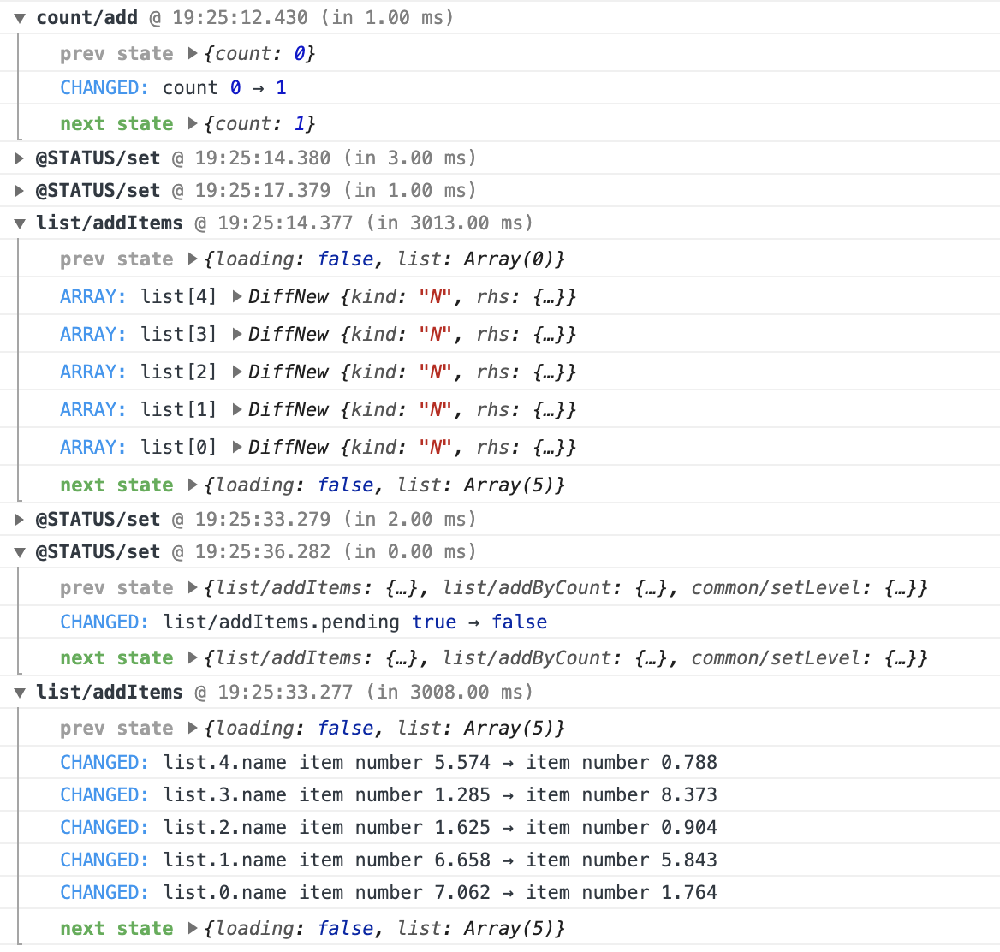

# hookstore-logger

[](https://npmjs.org/package/hookstore-logger)
[](https://travis-ci.org/react-kit/hookstore)
[](https://coveralls.io/r/react-kit/hookstore)
[](https://npmjs.org/package/hookstore-logger)

redux-logger style middeware for [hookstore](https://github.com/react-kit/hookstore.git)



## Install

```bash
$ npm install hookstore-logger -D
# or
$ yarn add hookstore-logger
```

## Usage

```javascript
import { Provider, applyMiddlewares } from 'hookstore';
import logger from 'hookstore-logger';

const model = {
  name: 'foo',
  state: {},
  actions: {},
};

function App() {
  // App component code
}

function Root = () => {
  const middlewares = [
    logger({ showDiff: true, showTook: true }),
    // add other middlewares
  ];

  applyMiddlewares(middlewares);

  return <Provider model={model}><App /></Provider>;
}

ReactDOM.render(<Root />, document.querySelector('app'));
```

Injoy it!
